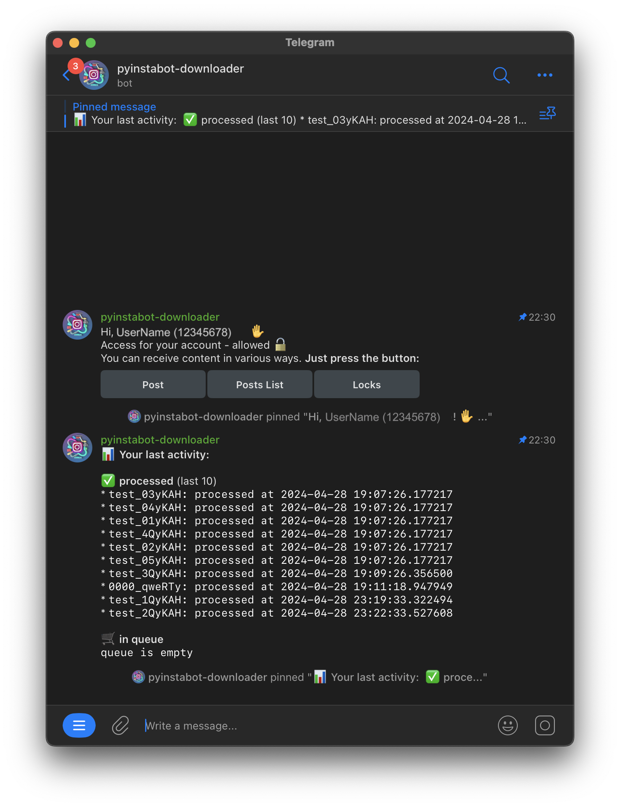
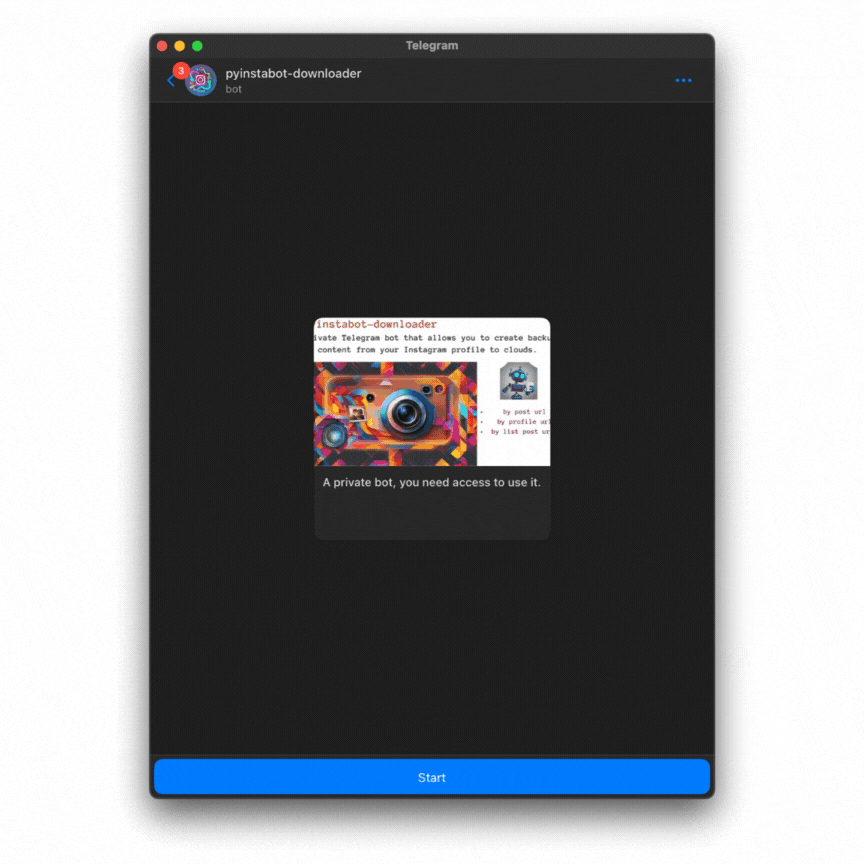
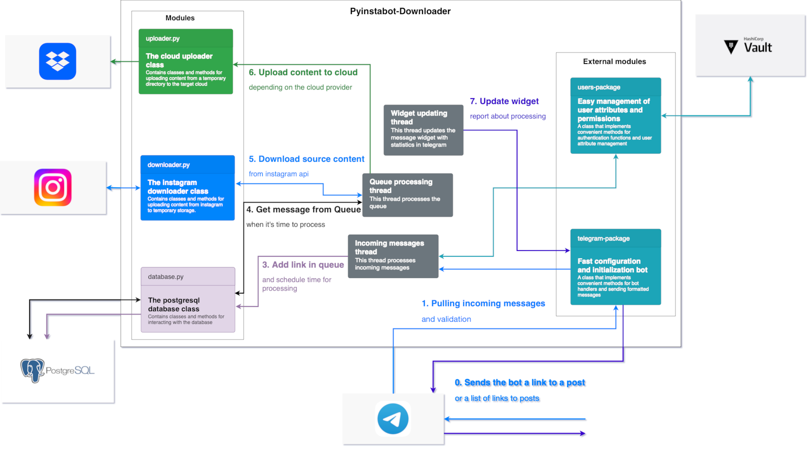
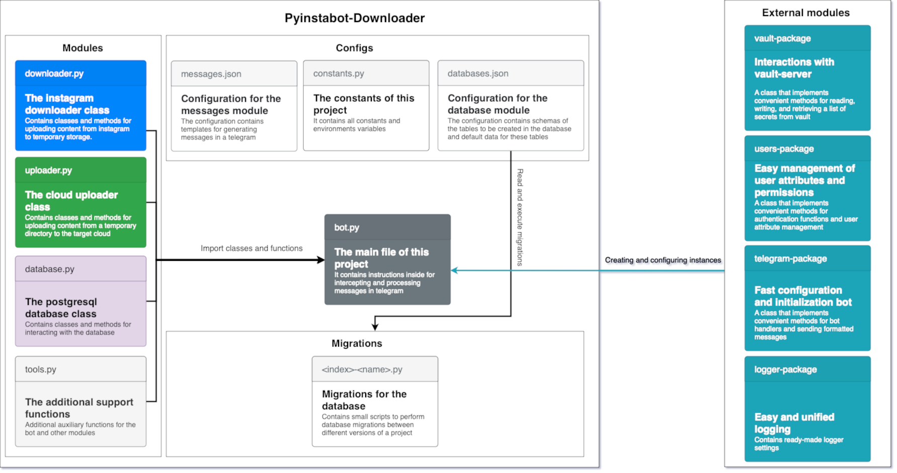

# Pyinstabot-downloader
[](https://github.com/obervinov/pyinstabot-downloader/actions/workflows/github-code-scanning/codeql)
[](https://github.com/obervinov/pyinstabot-downloader/actions/workflows/pr.yaml)
[](https://github.com/obervinov/pyinstabot-downloader/actions/workflows/release.yaml)


[](https://www.python.org/downloads/release/python-3107/)
[](https://opensource.org/licenses/MIT)

## Table of contents
- [About this project](#-about-this-project)
- [Project architecture](#-project-architecture)
- [Requirements](#-requirements)
- [Environment variables](#-environment-variables)
- [Prepare and configure environment](#-prepare-and-configure-environment)
  - [Target storage of the content](#target-storage-of-the-content)
  - [Bot configuration source and supported parameters](#bot-configuration-source-and-supported-parameters)
  - [Bot persistent data storage](#bot-persistent-data-storage)
- [How to run project](#-how-to-run-project)


##  About this project
This project is a telegram bot that allows you to create backups of content from your Instagram profile to Dropbox or Mega clouds, as well as in the local file system.
<p align="center">
  
</p>

**Main functions**
- a backup copy of a __specific post__ by link
- a backup copy of __list of posts__ by links
- the ability to backup to the __Mega__ or __Dropbox__ clouds

**Preview of the bot in action**
<p align="center">
  
  
</p>


##  Project architecture
**Users flow**


**Code structure**

</br>

##  Requirements
-  Vault server - [a storage of secrets for bot with kv v2 engine](https://developer.hashicorp.com/vault/docs/secrets/kv/kv-v2)
-  Dropbox [api token](https://dropbox.tech/developers/generate-an-access-token-for-your-own-account)</img> or   Mega.nz [account](https://mega.nz)</img>
-  Telegram bot api token - [instructions for creating bot and getting a token of api](https://learn.microsoft.com/en-us/azure/bot-service/bot-service-channel-connect-telegram?view=azure-bot-service-4.0)
-  Instagram username/password - [login and password from the instagram account, it is advisable to create a new account](https://www.instagram.com/accounts/emailsignup/)
-  Postgresql - [a storage of project persistent data](https://www.postgresql.org/download/)
</br>

##  Environment variables
| Variable  | Description | Default value |
| ------------- | ------------- | ------------- |
| `LOGGER_LEVEL` | [The logging level of the logging module](https://docs.python.org/3/library/logging.html#logging-levels) | `INFO` |
| `BOT_NAME` | The name of the bot, used to determine the unique mount point in the vault | `pyinstabot-downloader` |
| `MESSAGES_CONFIG` | The path to the message template file | `src/configs/messages.json` |
| `VAULT_ADDR`  | The address at which the vault server will be available to the bot | `None` |
| `VAULT_APPROLE_ID` | [Approle id created during vault setup](https://developer.hashicorp.com/vault/docs/auth/approle) | `None` |
| `VAULT_APPROLE_SECRETID`  | [Approle secret id created during vault setup](https://developer.hashicorp.com/vault/docs/auth/approle) | `None` |
</br>

##  Prepare and configure environment

### Target storage of the content
####  If dropbox is going to be used as the target storage, you need to
- [Create a dropbox account](https://www.dropbox.com/register)
- Generate an application token according to the instructions [here](https://dropbox.tech/developers/generate-an-access-token-for-your-own-account) and [here](https://developers.dropbox.com/ru-ru/oauth-guide)
- [More documentation](https://www.dropbox.com/developers/documentation/python#overview)

####  If mega is going to be used as the target storage, you need to
- [Create a mega account](https://mega.nz/register)
- Don't turn on `2fa`, because the library `mega.py` [can't work with 2fa](https://github.com/odwyersoftware/mega.py/issues/19) (it'll probably be fixed in https://github.com/obervinov/pyinstabot-downloader/issues/36)
</br>

### Bot configuration source and supported parameters
 All bot configuration is stored in the `Vault Secrets`</br>
_except for the part of the configuration that configures the connection to `Vault`_</br>
- `configuration/database`: database connection parameters
  ```json
  {
    "database": "pyinstabot-downloader",
    "host": "postgresql.example.com",
    "password": "qwerty123",
    "port": "5432",
    "user": "user1"
  }
  ```
  </br>
- `configuration/downloader-api`: downloader module configuration (for downloading content from instagram)
  ```json
  {
    "enabled": "True",
    "fatal-status-codes": "[400, 401, 429, 500]",
    "iphone-support": "False",
    "login-method": "session",
    "password": "qwerty123",
    "session-base64": "string==",
    "session-file": "/directory/downloader/session",
    "user-agent": "Mozilla/5.0 (Windows NT 10.0; Win64; x64) AppleWebKit/537.36 (KHTML, like Gecko) Chrome/98.0.4758.102 Safari/537.36",
    "username": "username1"
  }
  ```
  Clarification of non-obvious parameters
  - `fatal-status-codes`: a list of status codes that are considered fatal and stop downloader module work
  - `iphone-support`: if `True`, the downloader module will use the iphone user-agent
  - `login-method`: the method of logging into the instagram account (`session`, `password`, `anonymous`)
  - `session-base64`: the session file content in base64 format
  </br>
- `configuration/telegram`: telegram bot configuration
  ```json
  {
    "token": "123456:qwerty"
  }
  ```
  </br>
- `configuration/uploader-api`: uploader module configuration (for upload content to the target storage)
  ```json
  {
    "destination-directory": "cloud-directory/",
    "enabled": "True",
    "exclude-types": "[\".txt\", \".tmp\"]",
    "password": "qwerty123",
    "source-directory": "data/",
    "storage-type": "dropbox",
    "username": "username1"
  }
  ```
  Clarification of non-obvious parameters
  - `destination-directory`: the directory in the target storage where the content will be uploaded
  - `exclude-types`: a list of file extensions that will be excluded from the upload (for example, `.txt` - text from the post)
  - `source-directory`: the directory where the content will be stored before uploading (temporary directory)
  - `storage-type`: the type of storage where the content will be uploaded (`dropbox`, `mega`)
  </br>
- `configuration/users/<telegram_user_id>`: user permissions configuration
  ```json
  {
    "requests": "{\"requests_per_day\": 10, \"requests_per_hour\": 1, \"random_shift_minutes\": 60}",
    "roles": "[\"post\", \"posts_list\"]",
    "status": "allowed"
  }
  ```
  Clarification of non-obvious parameters
  - `requests`: the number of requests that the user can make per day and per hour, as well as the random shift in minutes (scheduling of message processing from the queue works on the basis of this parameter)
  - `roles`: list of roles that allow to use the corresponding functionality ([available roles](src/configs/constants.py#L19-L23)).
  - `status`: allowed or denied user access to the bot

#### You can use an existing vault-server or launch a new one using docker-compose
- instructions for starting and configuring a new vault-server
```bash
docker-compose -f docker-compose.yml up vault-server -d
poetry install
curl -L https://gist.githubusercontent.com/obervinov/9bd452fee681f0493da7fd0b2bfe1495/raw/bbc4aad0ed7be064e9876dde64ad8b26b185091b/setup_vault_server.py | python3 --url=http://localhost:8200 --name=pyinstabot-downloader --policy=vault/policy.hcl
```

- instructions for configuring an existing vault server
```bash
poetry install
curl -L https://gist.githubusercontent.com/obervinov/9bd452fee681f0493da7fd0b2bfe1495/raw/bbc4aad0ed7be064e9876dde64ad8b26b185091b/setup_vault_server.py | python3 --url=http://localhost:8200 --name=pyinstabot-downloader --policy=vault/policy.hcl --token=hvs.123456qwerty
```

  `setup_vault_server.py` - This script performs a quick and convenient configuration of the vault-server for this bot project
  - `initial` initialization of vault-server (_if it is new vault-server_)
  - `unseal` vault-server (_if it is new vault-server_)
  - creating an isolated `mount point`
  - loading `policy.hcl`
  - creating an `approle`

All these actions can also be performed using the official `vault` cli
```bash
vault operator init
vault operator unseal
vault secrets enable -path=pyinstabot-downloader kv-v2 
vault policy write pyinstabot-downloader vault/policy.hcl
vault auth enable -path=pyinstabot-downloader approle
vault write auth/pyinstabot-downloader/role/pyinstabot-downloader \
    token_policies=["pyinstabot-downloader"] \
    token_type=service \
    secret_id_num_uses=0 \
    token_num_uses=0 \
    token_ttl=1h \
    bind_secret_id=true \
    mount_point="pyinstabot-downloader" \
    secret_id_ttl=0
```
</br>

### Bot persistent data storage
 Persistent data storage is implemented using `Postgresql`</br>
You can familiarize yourself with the
- data structure, tables and assignment of tables [here](src/configs/databases.json)
- migrations [here](src/migrations/)

The database structure is created automatically when the bot starts. Bot checks the database structure and creates missing tables if necessary.
After checking the database structure, the bot executes the migrations in the order of their numbering.</br>
Required only database owner rights in `Vault` for the bot to create tables and execute migrations.

**What data is stored in tables:**
- user request queue
- history of processed user requests 
- information about users activity (requests and contacts)
- completed migrations
- messages sent by the bot (to update them)
</br>

##  How to run project
```sh
export VAULT_APPROLE_ID={change_me}
export VAULT_APPROLE_SECRETID={change_me}
export VAULT_ADDR={change_me}
docker compose -f docker-compose.yml up -d
```
</br>

##  GitHub Actions
| Name  | Version |
| ------------------------ | ----------- |
| GitHub Actions Templates | [v1.2.6](https://github.com/obervinov/_templates/tree/v1.2.6) |
