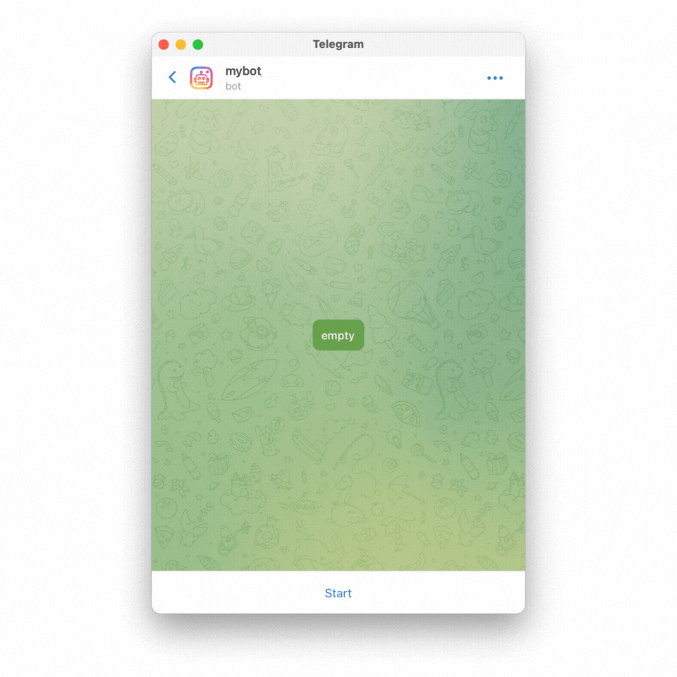
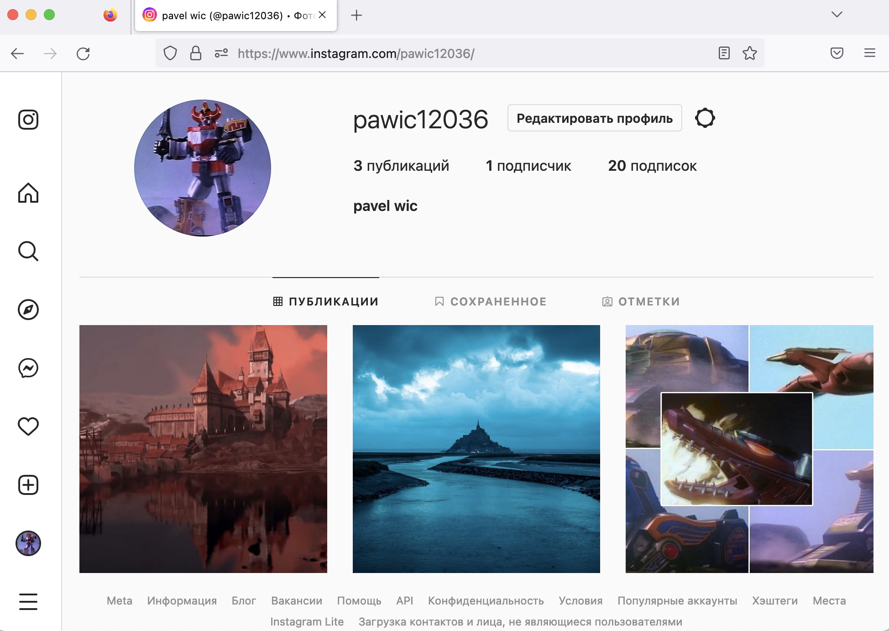
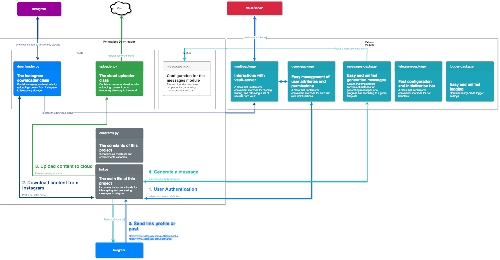
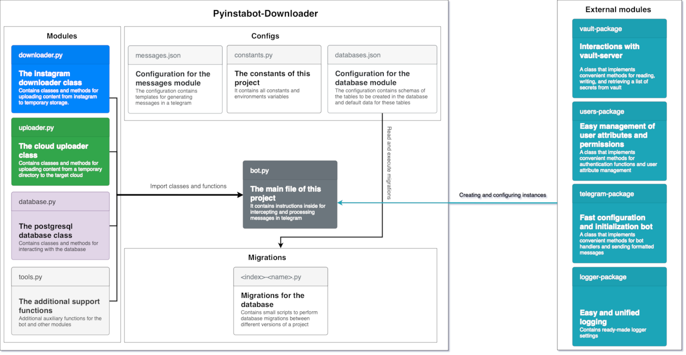

# Pyinstabot-downloader
[](https://github.com/obervinov/pyinstabot-downloader/actions/workflows/release.yml)
[](https://github.com/obervinov/pyinstabot-downloader/actions/workflows/github-code-scanning/codeql)
[](https://github.com/obervinov/pyinstabot-downloader/actions/workflows/tests.yml)
[](https://github.com/obervinov/pyinstabot-downloader/actions/workflows/build.yml)


##  GitHub Actions
| Name  | Version |
| ------------------------ | ----------- |
| GitHub Actions Templates | [v1.0.5](https://github.com/obervinov/_templates/tree/v1.0.5) |


##  About this project
This project is a telegram bot that allows you to create backups of content from your Instagram profile to Dropbox or Mega clouds, as well as in the local file system.

Main functions:
- a backup copy of all posts from the profile
- a backup copy of a specific post by link
- the ability to backup to the mega or dropbox cloud

For example:
<p align="center">
  
  
</p>

##  Project architecture
Code logic


Code dependecies


##  Repository map
```sh
.
├── CHANGELOG.md
├── Dockerfile
├── LICENSE
├── README.md
├── SECURITY.md
├── doc
│   ├── bot-preview.gif
│   ├── diagram-code.png
│   ├── diagram-logic.png
│   ├── instagram-profile.png
│   └── pyinstabot-downlaoder.drawio
├── docker-compose.dev.yml
├── docker-compose.prod.yml
├── requirements.txt
├── src
│   ├── bot.py
│   ├── configs
│   │   └── messages.json
│   ├── constants.py
│   └── tools
│       ├── __init__.py
│       ├── downloader.py
│       └── uploader.py
└── vault
    └── policy.hcl
```

##  Requirements
-  Vault server - [a storage of secrets for bot with kv v2 engine](https://developer.hashicorp.com/vault/docs/secrets/kv/kv-v2)
-  Dropbox [api token](https://dropbox.tech/developers/generate-an-access-token-for-your-own-account)</img> or  Mega.nz [account](https://mega.nz)</img>
-  Telegram bot api token - [instructions for creating bot and getting a token of api](https://learn.microsoft.com/en-us/azure/bot-service/bot-service-channel-connect-telegram?view=azure-bot-service-4.0)
-  Instagram username/password - [login and password from the instagram account, it is advisable to create a new account](https://www.instagram.com/accounts/emailsignup/)


##  Environment variables
| Variable  | Description | Default value |
| ------------- | ------------- | ------------- |
| `LOGGER_LEVEL` | [The logging level of the logging module](https://docs.python.org/3/library/logging.html#logging-levels) | `INFO` |
| `BOT_NAME` | The name of the bot, used to determine the unique mount point in the vault | `pyinstabot-downloader` |
| `MESSAGES_CONFIG` | The path to the message template file | `src/configs/messages.json` |
| `STORAGE_TYPE` | Type of target storage for saving uploaded content from instagram (`dropbox`, `mega` or `local`) | `mega` |
| `STORAGE_EXCLUDE_TYPE`| Types of files that you want to exclude from uploading to the cloud | `.txt` |
| `TEMPORARY_DIR` | Temporary directory for saving uploaded content from instagram | `tmp/` |
| `INSTAGRAM_SESSION` | The path for storing the file with the instagram session | `.session` |
| `INSTAGRAM_USERAGENT`  | [User Agent to use for HTTP requests. Per default, Instaloader pretends being Chrome/92 on Linux](https://instaloader.github.io/cli-options.html#cmdoption-user-agent) | `None` |
| `VAULT_ADDR`  | The address at which the vault server will be available to the bot | `None` |
| `VAULT_APPROLE_ID` | [Approle id created during vault setup](https://developer.hashicorp.com/vault/docs/auth/approle) | `None` |
| `VAULT_APPROLE_SECRETID`  | [Approle secret id created during vault setup](https://developer.hashicorp.com/vault/docs/auth/approle) | `None` |


##  Prepare
### Target storage of the content
####  If dropbox is going to be used as the target storage, you need to:
- [Create a dropbox account](https://www.dropbox.com/register)
- Generate an application token according to the instructions [here](https://dropbox.tech/developers/generate-an-access-token-for-your-own-account) and [here](https://developers.dropbox.com/ru-ru/oauth-guide)

[More documentation](https://www.dropbox.com/developers/documentation/python#overview)

####  If mega is going to be used as the target storage, you need to:
- [Create a mega account](https://mega.nz/register)
- Don't turn on 2fa (because the module mega.py can't work with 2fa https://github.com/odwyersoftware/mega.py/issues/19)

####  If the local file system will be used as the target storage:
- Set to environment variable `TEMPORARY_DIR` the desired local path for saving content (ex. `/opt/backup/instagram`)

Such a strange variable name comes from the logic of the bot. The `TEMPORARY_DIR` variable is used as an intermediate buffer between the stage of downloading content from Instagram and then uploading it to the target storage.

If the target storage is dropbox or mega, then files from the temporary directory are simply deleted after successful upload to the cloud.

If the target storage is a local file system, then any further steps to process the files will be unnecessary. The process just immediately uploads the content from Instagram to the target directory (temporary directory), after which nothing happens to the files.

### Storing project configuration and project history
 All persistent project data is stored in **Vault**:
- stores project configuration parameters
- keeps the history of already uploaded posts from instagram
- stores information about user authorization events
- stores attributes and user rights

#### You can use an existing vault-server or launch a new one using docker-compose:
- instructions for starting and configuring a new vault-server
```bash
docker-compose -f docker-compose.dev.yml up vault-server -d
python3 ../tools/vault/setup_instance.py --url=http://localhost:8200 --name=pyinstabot-downloader --policy=vault/policy.hcl
```

- instructions for configuring an existing vault server
```bash
python3 ../tools/vault/setup_instance.py --url=http://localhost:8200 --name=pyinstabot-downloader --policy=vault/policy.hcl --token=hvs.123456qwerty
```

#### Required bot configuration parameters
```bash
vault kv put pyinstabot-downloader/configuration/dropbox token={dropbox_token}
vault kv put pyinstabot-downloader/configuration/telegram token={telegram_token}
vault kv put pyinstabot-downloader/configuration/permissions {your_telegram_userid}=allow
vault kv put pyinstabot-downloader/configuration/instagram username={username} password={password}
vault kv put pyinstabot-downloader/configuration/mega username={username} password={password}
```

##  How to run with docker-compose
```sh
export VAULT_APPROLE_ID={change_me}
export VAULT_APPROLE_SECRETID={change_me}
export VAULT_ADDR={change_me}

docker-compose -f docker-compose.dev.yml up vault-server -d
# or
docker-compose -f docker-compose.prod.yml up
```


##  How to run a bot locally without a docker
**You need an already running and configured vault to use the approle and kv v2 engine**
```sh
pip3 install -r requirements.txt

export VAULT_APPROLE_ID={change_me}
export VAULT_APPROLE_SECRETID={change_me}
export VAULT_ADDR={change_me}
export BOT_NAME=pyinstabot-downloader
export LOGGER_LEVEL=INFO
export STORAGE_TYPE=mega
export INSTAGRAM_SESSION=/home/python/.config/instaloader/.session
export STORAGE_EXCLUDE_TYPE=".txt"

python3 src/bot.py
```
