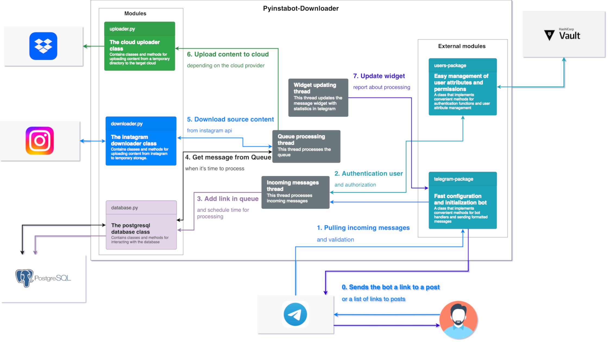

# Pyinstabot-downloader
[](https://github.com/obervinov/pyinstabot-downloader/actions/workflows/github-code-scanning/codeql)
[](https://github.com/obervinov/pyinstabot-downloader/actions/workflows/pr.yaml)
[](https://github.com/obervinov/pyinstabot-downloader/actions/workflows/release.yaml)


[](https://www.python.org/downloads/release/python-3107/)
[](https://opensource.org/licenses/MIT)

## Table of contents
- [About this project](#-about-this-project)
- [Project architecture](#-project-architecture)
- [Requirements](#-requirements)
- [Environment variables](#-environment-variables)
- [Prepare and configure environment](#-prepare-and-configure-environment)
  - [Target storage of the content](#target-storage-of-the-content)
  - [Bot configuration source and supported parameters](#bot-configuration-source-and-supported-parameters)
  - [Bot persistent data storage](#bot-persistent-data-storage)
- [How to run project locally](#-how-to-run-project-locally)


##  About this project
This project is a Telegram bot that allows you to upload posts from your Instagram profile to clouds like Dropbox, Mega or any WebDav compatible cloud storage.
<p align="center">
  
</p>

**Main functions**
- a backup copy of a __specific post__ by link
- a backup copy of __list of posts__ by links
- the ability to backup to the __Mega__, __Dropbox__ or any __WebDav__ compatible cloud storage.

**Preview of the bot in action**
<p align="center">
  
  
</p>


##  Project architecture
**Users flow**


**Code structure**

</br>

##  Requirements
-  **Vault server**
   - [store the project configuration in kv2](https://developer.hashicorp.com/vault/docs/secrets/kv/kv-v2)
   - [generate access credentials in the database](https://developer.hashicorp.com/vault/docs/secrets/databases)
   - [prepare the vault server](scripts/vault-init.sh)
-  **Cloud Storage** (choose one)
   - dropbox: [api token](https://dropbox.tech/developers/generate-an-access-token-for-your-own-account)
   - mega: [account](https://mega.nz)
   - webdav: [url, username and password](https://docs.nextcloud.com/server/latest/user_manual/en/files/access_webdav.html)
-  **Telegram**
   - bot: [api token](https://learn.microsoft.com/en-us/azure/bot-service/bot-service-channel-connect-telegram?view=azure-bot-service-4.0)
-  **Instagram** (choose one)
   - account: [username/password](https://www.instagram.com/accounts/emailsignup/) or [a ready uploaded session from the browser](https://raw.githubusercontent.com/instaloader/instaloader/master/docs/codesnippets/615_import_firefox_session.py)
-  **Postgresql**
   - database: [empty database](scripts/psql-init.sh)
</br>

##  Environment variables
| Variable  | Description | Default value |
| ------------- | ------------- | ------------- |
| `LOGGER_LEVEL` | [The logging level of the logging module](https://docs.python.org/3/library/logging.html#logging-levels) | `INFO` |
| `TELEGRAM_BOT_NAME` | The name of the bot, used to determine the unique mount point in the vault | `pyinstabot-downloader` |
| `MESSAGES_CONFIG` | The path to the message template file | `src/configs/messages.json` |
| `VAULT_*` | All supported vault environment variables can be found [here](https://github.com/obervinov/vault-package/tree/v3.0.0?tab=readme-ov-file#-supported-environment-variables) | - |
</br>

##  Prepare and configure environment

### Target storage of the content
####  If dropbox is going to be used as the target storage, you need to
- [Create a dropbox account](https://www.dropbox.com/register)
- Generate an application token according to the instructions [here](https://dropbox.tech/developers/generate-an-access-token-for-your-own-account) and [here](https://developers.dropbox.com/ru-ru/oauth-guide)
- [More documentation](https://www.dropbox.com/developers/documentation/python#overview)

####  If mega is going to be used as the target storage, you need to
- [Create a mega account](https://mega.nz/register)
- Don't turn on `2fa`, because the library `mega.py` [can't work with 2fa](https://github.com/odwyersoftware/mega.py/issues/19) (it'll probably be fixed in https://github.com/obervinov/pyinstabot-downloader/issues/36)

####  If webdav compatible cloud storage is going to be used as the target storage, you need to
- Create an account in any cloud that supports WebDav
- Get the WebDav url from your cloud provider
- Get the WebDav username and password from your cloud provider
</br>

### Bot configuration source and supported parameters
 All bot configuration is stored in the `Vault Secrets` (_except for the part of the configuration that configures the connection to `Vault`_)
</br>

- `pyinstabot-downloader-database` - vault database engine mount point, returns the temporary username and password for the database. More information about the database engine can be found [here](https://developer.hashicorp.com/vault/docs/secrets/databases/postgresql) and [here](https://developer.hashicorp.com/vault/tutorials/db-credentials/database-secrets)
  </br>

- `configuration/database`: database connection parameters
  ```json
  {
    "dbname": "pyinstabot-downloader",
    "host": "postgresql.example.com",
    "port": "5432",
    "connections": "10"
  }
  ```
  </br>

- `configuration/telegram`: telegram bot configuration
  ```json
  {
    "token": "123456:qwerty"
  }
  ```
  </br>

- `configuration/downloader-api`: downloader module configuration (for downloading content from instagram)

  Clarification of non-obvious parameters
  - `fatal-status-codes`: a list of status codes that are considered fatal and stop downloader module work
  - `iphone-support`: if `True` the downloader module will use the iphone user-agent
  - `login-method`: the method of logging into the instagram account (`session`, `password`, `anonymous`)
  - `session-base64`: the session file content in base64 format (only for `session` login method)
  ```json
  {
    "enabled": "True",
    "fatal-status-codes": "[400, 401, 429, 500]",
    "iphone-support": "False",
    "login-method": "session",
    "password": "qwerty123",
    "session-base64": "string==",
    "session-file": "/directory/downloader/session",
    "user-agent": "Mozilla/5.0 (Windows NT 10.0; Win64; x64) AppleWebKit/537.36 (KHTML, like Gecko) Chrome/98.0.4758.102 Safari/537.36",
    "username": "username1"
  }
  ```
  </br>

- `configuration/uploader-api`: uploader module configuration (for upload content to the target storage)

  Clarification of non-obvious parameters
  - `destination-directory`: the directory in the target storage where the content will be uploaded
  - `exclude-types`: a list of file extensions that will be excluded from the upload (for example, `.txt` - text from the post)
  - `source-directory`: the directory where the content will be stored before uploading (temporary directory)
  - `storage-type`: the type of storage where the content will be uploaded (`dropbox`, `mega`, `webdav`)
  - `url`: the url of the target webdav directory (only for `webdav` storage)
  ```json
  {
    "enabled": "True",
    "destination-directory": "cloud-directory/",
    "exclude-types": "[\".txt\", \".tmp\"]",
    "password": "qwerty123",
    "source-directory": "data/",
    "storage-type": "webdav",
    "username": "username1",
    "url": "https://webdav.example.com/directory"
  }
  ```
  </br>

- `configuration/users/<telegram_user_id>`: users permissions and attributes

  Clarification of non-obvious parameters
  - `requests`: the number of requests that the user can make per day and per hour, as well as the random shift in minutes (scheduling of message processing from the queue works on the basis of this parameter)
  - `roles`: list of roles that allow to use the corresponding functionality ([available roles](src/configs/constants.py#L11-L15)).
  - `status`: allowed or denied user access to the bot
  ```json
  {
    "requests": "{\"requests_per_day\": 10, \"requests_per_hour\": 1, \"random_shift_minutes\": 60}",
    "roles": "[\"post\", \"posts_list\"]",
    "status": "allowed"
  }
  ```

#### You can use an existing vault-server or launch a new one using docker-compose
Scripts for configuring the vault-server are located in the [vault-init.sh](scripts/vault-init.sh)
- instructions for starting and configuring a new vault-server
```bash
# Clone the repository
git clone https://github.com/obervinov/pyinstabot-downloader.git
cd pyinstabot-downloader

# Run vault-server
docker-compose -f docker-compose.yml up vault-server -d

# Initialize and unseal new vault-server
export VAULT_ADDR=http://0.0.0.0:8200
vault operator init
vault operator unseal

# Run the script for configuring the vault-server for this bot project
export VAULT_TOKEN=hvs.123456qwerty
./scripts/vault-init.sh
```

- instructions for configuring an existing vault server
```bash
# Clone the repository
git clone https://github.com/obervinov/pyinstabot-downloader.git
cd pyinstabot-downloader

# Run the script for configuring the vault-server for this bot project
export VAULT_ADDR=https://vault.example.com:8200
export VAULT_TOKEN=hvs.123456qwerty
./scripts/vault-init.sh
```
</br>

### Bot persistent data storage
 Persistent data storage is implemented using `Postgresql`
- data structure, tables and assignment of tables [here](src/configs/databases.json)
- migrations [here](src/migrations/)

The database structure is created automatically when the bot starts:
  1. bot checks the database structure and creates missing tables if necessary
  2. after checking the database structure, the bot executes the migrations in the order of their numbering

To quickly prepare an instance, you can execute the [psql-init.sh](scripts/psql-init.sh) script

```bash
git clone https://github.com/obervinov/pyinstabot-downloader.git
cd pyinstabot-downloader

export PGHOST=<host>
export PGPORT=<port>
export PGUSER=<user>
export PGPASSWORD=<password>
export PGDATABASE=postgres
./scripts/psql-init.sh
```


**What data is stored in tables:**
- users requests queue
- users metadata
- history of users requests
- history of processed messages
- migrations history
- service messages by the bot
</br>

##  How to run project locally
```sh
export VAULT_APPROLE_ID={change_me}
export VAULT_APPROLE_SECRET_ID={change_me}
export VAULT_ADDR={change_me}
docker compose -f docker-compose.yml up -d
```
</br>

##  GitHub Actions
| Name  | Version |
| ------------------------ | ----------- |
| GitHub Actions Templates | [v1.2.9](https://github.com/obervinov/_templates/tree/v1.2.9) |
